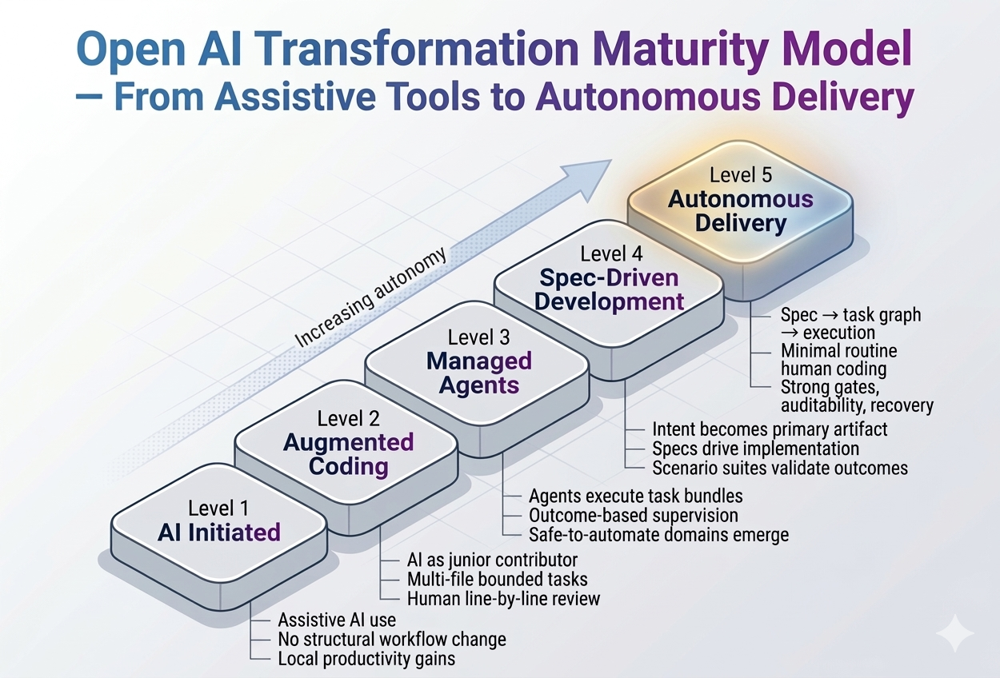

# Open AI Transformation Maturity Model (OAITMM)

An open, evidence-based framework for assessing how software organizations evolve from AI-assisted development to autonomous software production.

> From copilots to autonomous delivery.

---

## The Five-Level Model

  

This model describes how engineering organizations transition:

- From human-centric development to machine-executed production  
- From code as the primary artifact to intent as the primary artifact  
- From implementation bottlenecks to evaluation bottlenecks  
- From coordination overhead to constraint design  

### Levels

1. **AI Initiated** — Assistive tools, no structural change  
2. **Augmented Coding** — AI as junior contributor  
3. **Managed Agents** — Developer as orchestrator  
4. **Spec-Driven Development** — Intent as control plane  
5. **Autonomous Delivery** — Software production without human coding  

📖 Full model:

👉 **[5-Level Maturity Model](docs/model/5-level-maturity-model.md)**

---

## Assessment System Architecture

  

The assessment framework integrates three dimensions:

- **Capability Pillars** — What the organization can do  
- **Maturity Levels** — How work is performed  
- **Stage Gates** — Safety and readiness constraints  

These feed a unified scoring engine that determines effective maturity and recommended next moves.

📊 Full assessment framework:

👉 **[Assessment Hub](docs/model/assessment/README.md)**

---

## Why This Framework Exists

Most AI maturity models are:

- Tool-centric
- Vendor-shaped
- Strategy-level but operationally vague

OAITMM focuses on **operating-model transformation**, not tool adoption.

---

## Who This Is For

- CTOs and VPs of Engineering  
- Platform and productivity leaders  
- Transformation teams  
- Researchers and analysts  
- Consultants and practitioners  
- Organizations building AI-native SDLCs  

---

## What’s Included

- Formal maturity model  
- Detailed assessment framework  
- Unified scoring methodology  
- Stage gates and readiness checks  
- Simulated assessment examples  
- Case studies mapped to levels  
- Glossary and terminology  
- Templates for workshops and self-assessment  
- Open contribution model  

📘 Supporting docs:

- 👉 [Getting Started Guide](docs/GETTING_STARTED.md)  
- 👉 [Project Roadmap](docs/ROADMAP.md)  
- 👉 [Diagrams Index](docs/diagrams/README.md)

---

## How To Use

You can apply this framework to:

- Conduct organizational self-assessments  
- Facilitate leadership workshops  
- Plan transformation roadmaps  
- Benchmark against industry patterns  
- Guide platform and governance design  
- Extend for domain-specific use cases  

---

## Licensing

Unless otherwise noted:

**Documentation, framework text, diagrams, and assessment content**

→ Creative Commons Attribution-ShareAlike 4.0 International (CC BY-SA 4.0)

**Code, schemas, scripts, and tooling**

→ Apache License 2.0  

See `LICENSE` and `LICENSE-CODE` for details.

---

## Contributing

We welcome contributions from the community.

Examples of valuable contributions:

- New public case studies  
- Improved assessment questions  
- Domain-specific adaptations  
- Diagrams and visualizations  
- Tooling and automation  
- Corrections and clarifications  

Please read:

👉 `CONTRIBUTING.md`

---

## Governance

This project is maintained by the community with guidance from core maintainers.

See:

👉 `GOVERNANCE.md`

---

## Citation

If you use this framework in research, consulting, or publications, please cite it.

See:

👉 `CITATION.cff`

---

## Status

**Active — Initial public release (v0.1.0)**

This framework has reached its first stable public milestone and is ready for real-world evaluation and use.

Future releases will refine the model based on community feedback, case studies, and empirical evidence.

👉 See the latest release notes:  
https://github.com/linkpranay-ai/open-ai-transformation-maturity-model/releases/tag/v0.1.0

---
<!-- Site refresh -->
> Software engineering is being industrialized.  
> This framework exists to help organizations navigate that transition safely and effectively.
