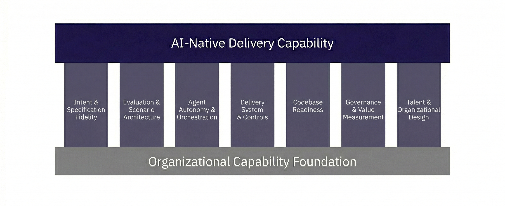

# Diagram Index

> **License:** CC BY-SA 4.0  
> https://creativecommons.org/licenses/by-sa/4.0/

This directory contains the official visual assets for the Open AI Transformation Maturity Model (O-AITMM).

These diagrams are intended for documentation, presentations, analysis, and discussion of the framework.  
Where possible, use these canonical versions to ensure consistency.

---

## Core Model

### Five-Level Maturity Model

Describes the progression from assistive AI use to autonomous software delivery.

---

## Conceptual Foundations

### Shift from Code to Intent

Illustrates the transformation in the primary artifact of software development—from human-written code to intent-driven and autonomous systems.

---

## Capability Structure

### Capability Pillars Architecture

Shows the structural capabilities required to sustain higher maturity levels.

---

## Assessment System

### Assessment Architecture

Explains how capability evidence, observed operating mode, and readiness constraints combine to determine effective maturity.

---

## Practical Tools

### Self-Assessment Ladder

Provides a quick visual aid for estimating an organization’s current maturity level.

---

## Identity Assets

### Framework Banner

Institutional banner used for repository headers and presentations.

